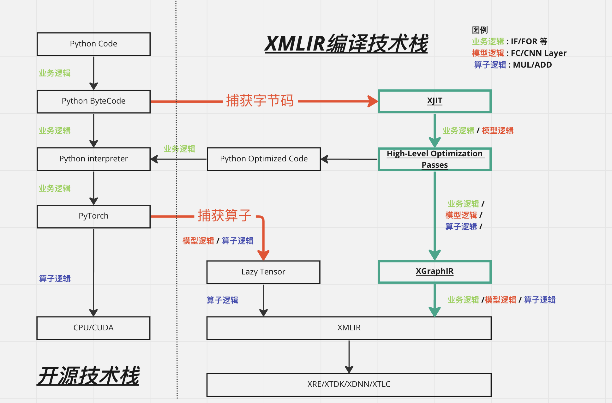
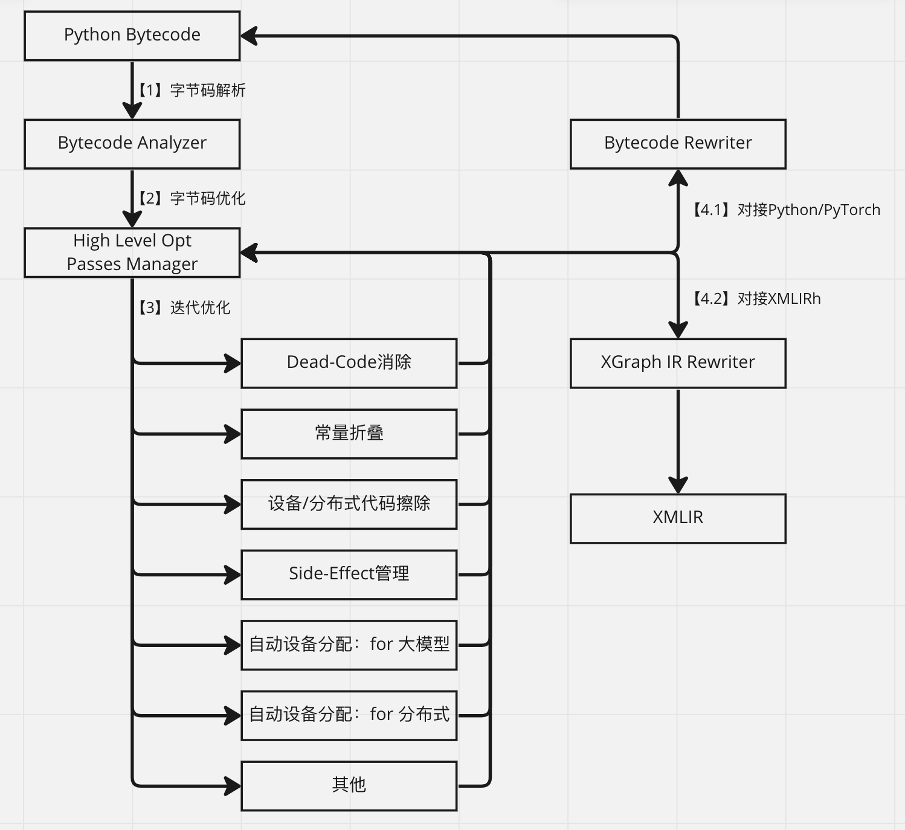

[TOC]

# Python AI编译前端

**2022.11.24** XMLIR整体架构与产品暂定名称（与 @许叶华 讨论的初步结构和名称，随时更新）

1. xacc：XPU AI Compiler Collection；以XMLIR为编译后端，结合新的编译前端扩展成完整AI编译工具链；
2. xacc.jit/xacc.aot: xacc的JIT/AOT API入口；
3. xacc.frontend: xacc的编译器前端，主要负责接入API、前端表达（python的bytecode和深度学习框架的接口）的分析、理解和优化；
4. xacc.backend：xacc的编译器后端，主要负责执行过程的分析和优化；包括codegen；

**2022.11.23** Bytecode Rewrite与TorchScript讨论

1. 与 @陈庆澍讨论Bytecode Rewrite在Paddle上应用的可行性，结论是技术可行，但从项目落地角度考虑先focus在PyTorch的支持上；
2. 与 @许叶华讨论TorchScript模型与Bytecode前端模式的异同：
   a. TorchScript基于AST变换，不能捕获Python的完整语义；
   b. TorchScript无法fallback回Python+PyTorch来执行，一旦编译失败就完全无法加速；
   c. Bytecode编译前端可以更完整捕获语义，即便编译失败也能fallback回Python+PyTorch执行；
   d. Bytecode编译前端能提供”尽力而为”的加速模式——如果模型中只有50%的部分XPU支持加速，那就让XMLIR加速这50%。而TorchScript模式哪怕模型只有1%的部分XPU不支持加速，就完全不能加速。


# 背景

## 简介

**定位**：Python AI编译前端（名字暂定XJIT）是XMLIR编译技术栈的一部分，负责：

1. 分析客户代码中的计算逻辑，交给XMLIR编译栈进行编译优化；
2. 更好的兼容PyTorch框架，提供更好的用户体验，提高模型交付速度；

**技术价值**

1. 抓取更为完整的语义，包括分支和循环等逻辑；
2. 抓取更多高层次信息，比如完整的Layer相关信息，而不是过细粒度的算子信息；
3. 提供更好的用户使用体验，让用户迁移模型到xpu的过程更为自动化；
   比如用户想要迁移的某模型代码：

```
python model.py
```

借助我们的编译前端，用户只需执行：

```
python -m xjit --device xpu0 model.py
```

**产品价值**

1. 帮助XMLIR适配更多的用户模型，让XPU获得更大的市场空间；

2. 提高XMLIR的交付速度，从客户角度更快落地、成单；

## AI框架前端技术

1. 静态图 vs DSL

   a. Caffe：2014-2017，第一代深度学习框架，使用pbtxt语法定义静态计算图图；
   b. Theano：2007-2017，自动微分+C代码生成，与Caffe同属于第一代框架；
   c. Torch 7：2002-2018，基于lua语言的科学计算框架，可以支持深度学习；

2. 静态图+Python DSL

   a. Tensorflow 1.x：2015-2019，第二代深度学习框架，首次基于细粒度算子构建深度学习模型；

3. define-by-run

   a. Chainer：2015-2019，日本某公司开发的深度学习框架，首次提出了define-by-run模式；
   b. Pytorch：2016-今，基于torch的C代码基础库开发的define-by-run模式框架，在学术界非常流行；
   c. Tensorflow 2.x：2019-今，谷歌迫于PyTorch的竞争，基于eager+动态图执行模型重构了tensorflow；

4. 函数式编程框架

   a. JAX：2020年左右，谷歌推出的新一代深度学习框架，JAX=AutoGrad+XLA。JAX抛弃了tensorflow中静态图的设计，转而使用Numpy语法，混合AutoGrad进行梯度求导，使用XLA进行编译加速。
   b. funtorch：2022年PyTorch社区推出的JAX仿制品，意在提供和JAX类似的高阶函数特性；
   小结：AI框架的前端技术并未像系统同学期望的那样，向静态图架构去演进，倒是反其道而行，专项更贴近Python语法，更贴近用户习惯的方向在演进。

## AI框架后端技术

与前端技术同步发展的是AI框架的后端技术：


1. Layer模块
   a. caffe
   b. Theano
   c. torch 7
2. 算子+DAG
   a. tensorflow
3. 编译优化
   a. XLA编译优化：tensorflow
   b. JIT编译
   i. tf.function
   ii. torch.jit
   c. TVM与MLIR
   i. TVM
   ii. MLIR
4. Python JIT编译优化
   a. torchdynamo

小结：后端技术主要趋势是深度异步化和编译技术栈。

## 总结

最近谷歌和Facebook在深度学习框架上推出的新技术有两个趋势：

1. 编译优化是AI框架的发展趋势；
2. AI框架前端技术，越来越向Python语法靠近；

Python前端+MLIR后端是一个比较完备的编译技术栈：

1. 有技术基础，并且符合未来技术趋势；
2. 能够帮助芯片类公司扩大市场空间，提高交付速度；

# 技术方案

## overview



XJIT从字节码捕获用户执行逻辑，并输出包含如下信息的图：

1. 业务逻辑；
2. 模型逻辑；
3. 算子逻辑（算子DAG）；

对比基于Lazy Tensor的tracing技术，XJIT能够完整捕获分支和循环逻辑，并且将高层信息带给算子图，为XMLIR中的算子图优化带来更多的信息。

XJIT可以直接输出XGraph IR给XMLIR，或者通过rewrite重写Python Bytecode，再交给Python解释器执行。这样设计有两个好处：

1. 技术优势：可以对比三条执行路径的结果，方便开发和调试；
2. 产品优势：可以开放XJIT给目标用户，帮助用户导出graph给到研发来进行评估和调试；

## 标准编译流程

标准编译流程是指对输入的Python字节码进行优化，并最终输出优化后字节码、图IR的过程：



标准编译流程主要由三部分组成：

1. 字节码分析；

2. 高层设备无关优化，具体包含如下pass：

   a. 死代码消除，用于降低整个计算图的复杂度，便于XMLIR的图编译优化；
   b. 常量折叠，用于提取不变量，降低XMLIR的图编译复杂度；
   c. 设备、分布式代码擦除：自动擦除模型代码内的设备绑定代码与分布式训练绑定代码，能够帮助XMLIR更好的适应用户代码；
   d. 副作用管理：用于管理Python语言的副作用，比如全局变量赋值等；
   e. 自动设备分配：用于更好的支持大模型和分布式；

3. Bytecode/GraphIR Rewriter：根据优化结果自动重写字节码或者图IR；

## 高级（特色）编译流程

高级编译流程，是指基于输入的Python字节码，向用户提供如下高阶功能：

1. JIT 缓存与AOT编译：XJIT对字节码的编译结果进行缓存，并且通过缓存实现AOT编译；
2. PGO编译：Profile Guided Optimization，是指XJIT通过Profile结果指导编译优化的过程；
3. 自动低精度/混合精度计算：借助PGO机制，在考虑编译速度的同时考虑编译精度；

一些问题的分析:

> Q：为何在XJIT中实现缓存、PGO和低精度等特性？
> A：XJIT与用户执行Python代码的过程耦合，可以较好的与Python的执行流程互动。并且可以通过Bytecode rewrite的机制，向Python解释器注入这些高阶功能需要的代码；

------

> Q：这些功能需要添加那些pass？
> A：需要添加一些适配PGO与低精度计算的pass，这些pass向上对接功能特性，向下服务XMLIR编译技术栈；比如：
>
> 1. 低精度相关pass：量化与反量化，剪支操作等；
> 2. pipeline相关优化，比如自动tensor切分和device分配；
> 3. 大模块replace操作，比如整体性替换transformer模块、卷积模块；

## 补充编译流程

补充编译流程用于编译PyTorch模型以外的代码，比较常见的有：

1. numpy数值计算代码；
2. pandas表格数据计算代码；

XJIT可以通过Bytecode rewrite技术，将这些计算也抽象成XMLIR的计算图表达，从而实现对整体数据流的加速。而训练数据流本身作为训练框架的一部分，对于训练速度和训练效果都有着至关重要的影响。

## 整体流程

XJIT整体分为两大部分：

1. 语言基础设施：负责与Python语言的交互：

   a. Interpreter Hook：注入到Python解释器中，截获Python执行流；
   b. Compiler Hook：在Interpreter Hook中，回调JIT编译器完成编译；
   c. Cache & AOT：缓存编译结果，或者通过编译实现AOT；

2. JIT编译器：

   a. Compiler Function：JIT编译器的驱动函数，驱动整个编译流程执行；
   b. Bytecode Analyzer：分析Python字节码，并联合High-Level Optimization Passes执行优化；
   c. Pass Manager：用于管理Bytecode Analyzer中的优化pass；
   d. Bytecide Rewriter：将优化后的程序重新生成执行代码，支持XMLIR后端和其他后端（其他后端用于调试目的）；
   e. Backend Driver：用于Bytecide Rewriter中驱动编译后端执行优化；
   f. Generated Backend Bytecode：由Bytecode Rewriter输出的Python字节码，会再交给Interpreter Hook注入给Python Interpreter来执行；
   g. XMLIR/PyTorch Backend：用于执行计算DAG，XMLIR使用自己的execution engine，PyTorch使用PyTorch自身；

## 详细设计


# 参考文献

1. Google JAX https://en.wikipedia.org/wiki/Google_JAX
2. 关于深度学习框架的比较 https://en.wikipedia.org/wiki/Comparison_of_deep_learning_software